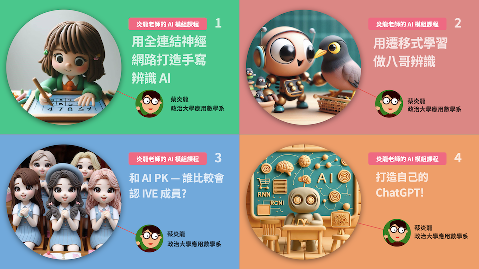

## 炎龍老師的 AI 模組課程
政治大學應用數學系 蔡炎龍

這個 AI 課程, 都是帶有實作的。而實作的設計都是幾乎最前面設定好, 很方便可以改成自己的專案。適合以下幾種情況:

1. 實作型工作坊
2. 融入課程, 特別是學生沒有太多程式背景的情況
3. 自學使用

非商業 (如教學) 等, 可以任意使用、改成更符合需求的樣子, 不需要特別徵求同意, 但如果提到出處幫忙廣告一下會非常感謝。另外願意分享做的調整或建議當然非常歡迎!

### 【模組一】用全連結神經網路打造手寫辨識 AI
人工智慧概念的介紹, 全連結神網路, 最後打造一個用 MNIST 數據集的手寫辨識 AI。

【投影片】[01. 用全連結神經網路打造手寫辨識 AI](https://www.slideshare.net/slideshow/ai-01-ai-ai-mnist/270178226)

【程式碼】[https://yenlung.me/AI01](https://yenlung.me/AI01)

### 【模組二】用遷移式學習做八哥辨識
CNN 原理介紹, 運用名門 CNN  做遷移式學習, 實作台灣常見三哥辨識, 但很容易更換為自己要做的分類 AI。

【投影片】[02. 用遷移式學習做八哥辨識]()

【程式碼】[https://yenlung.me/AI02](https://yenlung.me/AI02)

### 【模組三】和 AI PK 誰比較會認 IVE 成員?
介紹 representation learning 及 embedding 的概念, 用 contrastive learning 做人臉辨識的原理, 實作 K-Pop 女團 IVE 成員的辨識 (或任何自己想要做的人臉辨識)。 

【投影片】[03. 和 AI PK 誰比較會認 IVE 成員?]()

【程式碼】[https://yenlung.me/AI03](https://yenlung.me/AI03)

### 【模組四】打造自己的 ChatGPT!
文字生成 AI 的原理, 有「記憶」的神經網路 RNN 及 transformers, 大型語言模型 (LLM, 如 ChatGPT) 為什麼這麼厲害? 用 OpenAI API 打造自己的對話機器人!

【投影片】[04. 打造自己的 ChatGPT!]()

【程式碼】[https://yenlung.me/AI04](https://yenlung.me/AI04)
